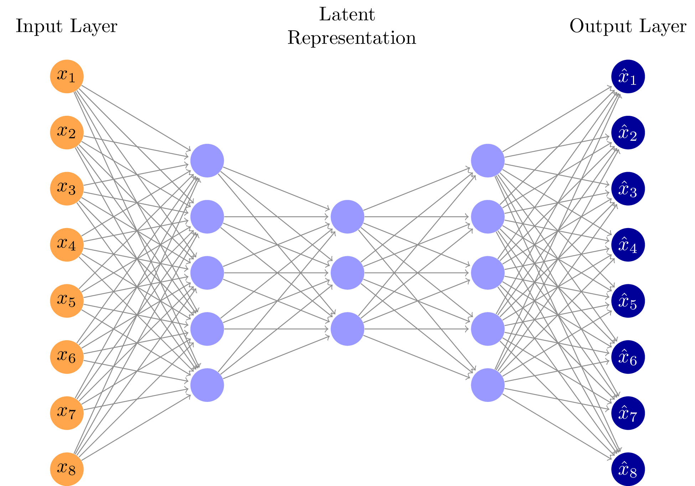

### AutoEncoder (Unsupervised)

Install 
```
torch
tqdm
```

using Python 3.11 and above should be ok.

#### AutoEncoder Example

The goal of an autoencoder is an unsupervised approach for anomaly detection that trains a neural network to overfit to the normal users class. The 2nd layer (in diagram) is representative to an Encoder Network, and outputs of the encoder network, are mapped down to a **lower dimensional** latent space (called the bottle neck layer), before being mapped back up to a layer with the same dimensions as the inputs.

The loss function aims to **minimize the reconstruction error** or 
$$
{\cal L}(x, x') = \begin{cases}
0 & \text{, if }x = x'\\
> 0 & \text{, otherwise} 
\end{cases} 
$$

where $x$ is the inputs, and $x'$ is the reconstructed outputs.

So for example, one possible loss function that can do this is the MSE.

Then eventually, we can set thresholds using the reconstruction error.


So I implemented it from scratch here! :)

However, by looking at the reconstruction error, I think the results weren't too good.


